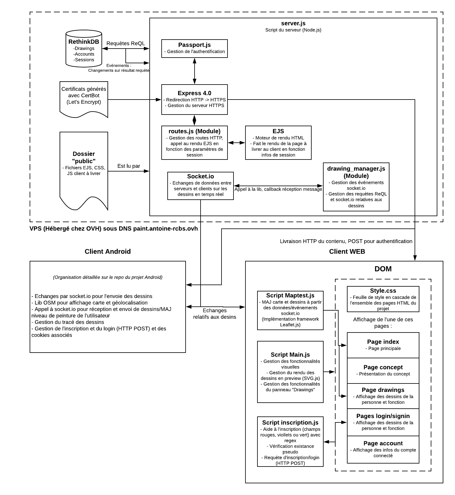

# Paint the World !

Voici notre projet **WEB**, réalisé dans le cadre de la 3ème année au département Télécommunication à l'INSA de Lyon. Paint the World est un jeu de peinture intéractif basé sur la géo-localistation. Baladez vous tout en peignant autour de vous et visualisez vos oeuvres ainsi que celles des autres joueurs en temps réel. Pour rejoindre l'aventure, rendez-vous directement sur notre  [site-web](https://paint.antoine-rcbs.ovh/) et sur l'application !

## Architecture

Ce projet s'articule autour de 3 composants : un site web, un serveur et une application Android.

## Utilisation

### Types de peinture
Il existe 2 types de peintures : permanente ou temporaire. La peinture temporaire disparait au bout d'un certain temps et peut être recouverte par de la peinture permanente. En achetant de la peinture permanente, vous avez la garantie que vos oeuvres ne seront jamais effacées ou recouvertes par d'autres utilisateurs.

### Site web
Sur la page d'**acceuil** du site web, visualisez l'ensemble des dessins réalisés aux 4 coins du monde. Chaque cluster vous indique le nombre de peintures présentes dans la région en question. Libre à vous de zoomer et parcourir la planète pour découvrir ces nombreuses oeuvres d'art.
L'onglet **Drawings** vous permet de visualiser un dessin aléatoire avec le bouton "random" en haut à droite. Si vous vous connectez en cliquant sur **Log In**, vous pourrez de plus accéder à tous vos dessins, triés par ordre de réalisation et les retrouver sur la carte. Si vous n'avez pas encore de compte, vous pouvez le créer des maintenant dans **Sign In**. Accédez aux informations de votre comptes dans **Account** : quantité de peinture utilisée et restante, statistiques et  paramètres de compte.

### Application
L'application vous permet de dessiner dans un rayon proche de votre géo-localisation. Réalisez votre peinture à l'aide des différentes features disponibles (taille de traits, couleur, type de peinture etc.) puis validez votre dessin une fois terminé pour le faire apparaitre sur la carte en direct.

## Connexion au serveur

Pour se connecter au serveur VPS en **ssh** (Linux Ubuntu 18.04) :

- Taper “**ssh root@paint.antoine-rcbs.ovh**” puis "yes" si le terminal pose une question.
- Vous êtes désormais dans le serveur en ssh ! Votre terminal se comporte comme si il était à la racine du PC 	qui constitue le serveur. Tout ce que vous faites comme commande sera exécuté sur celui ci et non sur votre machine. Vous êtes root donc pas besoin de “sudo” mais faites attention, vous avez le pouvoir de tout casser :D 

Pour **reloader** le serveur : "pm2 restart server"
Pour **monitorer** le serveur (console ect.) : "pm2" 
> Remarque : pm2 est un utilitaire qui permet de gérer des process node.js en tant que deamons
